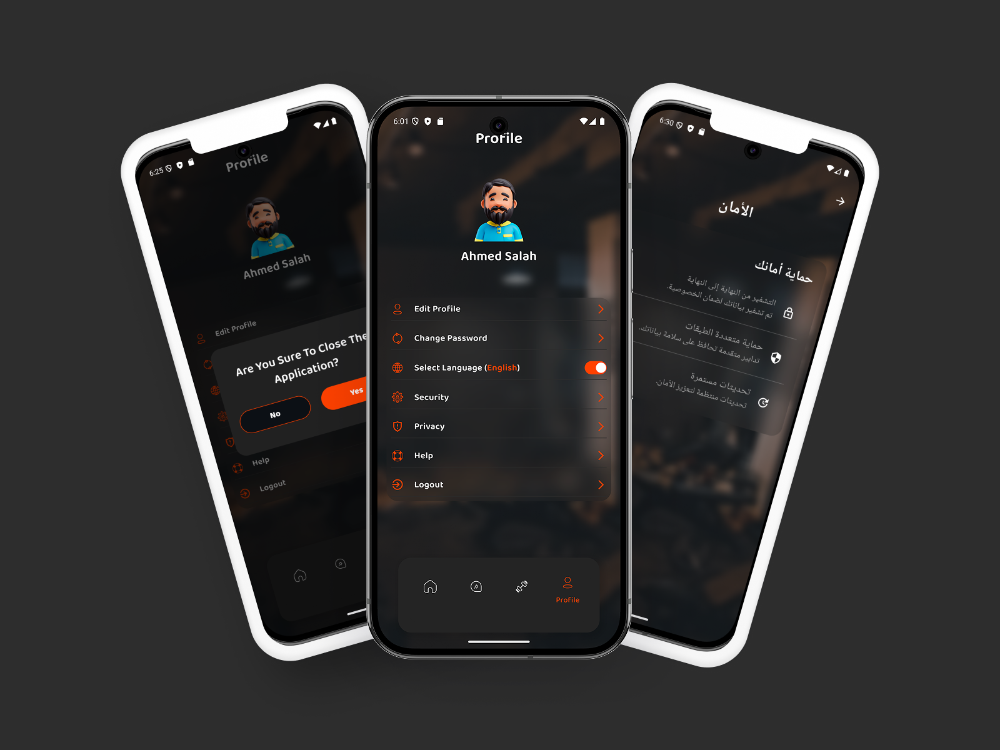

# Super Fitness

Welcome to **Super Fitness**, a Flutter application designed to help users achieve their fitness goals through personalized workouts, smart coaching, and nutrition recommendations.

---

## Table of Contents
- [Introduction](#introduction)
- [Features](#features)
- [Architecture & Technology](#architecture--technology)
- [Project Structure](#project-structure)
- [Screenshots](#screenshots)
- [Contributors](#contributors)
- [Task Management](#task-management)
- [Setup Instructions](#setup-instructions)
- [How to Contribute](#how-to-contribute)
- [License](#license)

---

## Introduction

**Super Fitness** is a cross-platform mobile application built with Flutter. Our mission is to empower users with an all-in-one fitness solution that combines:
- Personalized workout routines
- Smart AI coaching
- Nutrition/food recommendations

With an intuitive UI and carefully designed user flow, **Super Fitness** makes it easy for users to track their progress, set goals, and stay motivated.

---

## Features

### 1. Authentication and User Info Gathering
- **Sign Up / Sign In**: Secure user authentication.
- **User Details**: Collects essential user information (age, weight, height, gender, fitness goal, physical activity level).
- **Profile Completion**: Guides users to provide accurate data for more personalized recommendations.

### 2. Smart Coach (AI Assistance)
- **AI Chat Assistance**: Interact with an AI-based smart coach.
- **Chat History**: Stores and displays conversation history for easy reference.
- **Personalized Guidance**: Receives workout, nutrition, and motivational tips based on your profile.

### 3. Home Screen
- **Food Recommendations**: Suggests healthy meals and snacks based on user goals and preferences.
- **Categories**: Showcases workout categories (e.g., Gym, Fitness, Yoga, Aerobics, Trainer) with illustrative icons.
- **Popular Training**: Highlights trending or popular workout programs.

### 4. Workouts Screen
- **Workout List**: Displays various workouts.
- **Workout Details**: Each workout page includes:
    - Description
    - Duration
    - Equipment Needed
    - YouTube video links for guidance

### 5. Profile Screen
- **Profile Overview**: Displays user data such as age, weight, height, etc.
- **Edit Information**: Allows users to update their details and preferences.
- **Progress Tracking**: (Future enhancement) Track workout completion and body measurements.

---

## Architecture & Technology

- **Clean Architecture**: Separates the app into distinct layers for presentation, domain, and data.
- **State Management**: Utilizes **Cubit** (from the Bloc library) for predictable state management.
- **Dependency Injection**: Implemented using [Injectable](https://pub.dev/packages/injectable).
- **Repository Pattern**: Abstracts data operations for local and remote sources.
- **API Calls**: Uses [Retrofit](https://pub.dev/packages/retrofit) for network requests.
- **Localization**: Supports multiple languages with easy expansion using `.arb` files.

---

## Project Structure

Below is the current file structure for **Super Fitness**:

src/
├── data/
│    ├── api/
│    │    ├── core/
│    │    │    ├── api_request_models/
│    │    │    ├── api_response_models/
│    │    │    ├── constants/
│    │    │    └── errors/
│    │    ├── second_base_url/
│    │    ├── upload_api_manger/
│    │    ├── api_services.dart
│    │    ├── api_services.g.dart
│    │    └── network_factory.dart
│    ├── data_source/
│    └── ... (other data related files)
├── domain/
│    ├── entities/
│    ├── repositories/
│    └── usecases/
├── presentation/
│    ├── managers/      // Cubit/Bloc and state management classes
│    ├── pages/         // Screens (Home, Workouts, Profile, etc.)
│    └── shared/        // Shared widgets, themes, and utilities
├── main.dart
└── super_ditness_app.dart

### Explanation
- **data**: Holds all data-related logic, including:
    - **api**: Contains API service classes, request/response models, constants, and error handling.
    - **data_source**: Interfaces or classes for data retrieval (e.g., local DB or network).
- **domain**: Contains core business logic:
    - **entities**: Represents the fundamental data structures (plain Dart objects).
    - **repositories**: Abstract classes that define data operations.
    - **usecases**: Contain the application-specific business rules.
- **presentation**: Manages the user interface and state:
    - **managers**: Contains Cubits/Blocs or other state management classes.
    - **pages**: UI screens for the app (Home, Workouts, Profile, etc.).
    - **shared**: Shared widgets, themes, or utility classes used across multiple pages.
- **main.dart**: Entry point for the Flutter application.
- **super_ditness_app.dart**: The root widget that configures your app’s theme, routes, localization, etc.

## Screenshots

Below are some placeholder screenshots. Replace these with actual images of your app.

### Home Screen

*The Home Screen features food recommendations, workout categories, and popular training programs.*

### Workouts Screen

*The Workouts Screen lists available workouts and detailed pages with YouTube video integrations.*

### Profile Screen

*The Profile Screen allows users to view and edit their personal information.*

### Smart Coach Chat

*Interact with the AI-based Smart Coach through an intuitive chat interface.*

## Setup Instructions

1. **Clone the repository**:
   ```bash
   git clone https://github.com/your-username/super_fitness.git
    ```
2. **Navigate to the project directory**:
   ```bash
   cd super_fitness
   ```
3. **Install dependencies**:
   ```bash
    flutter pub get
    ```
4. **Generate files using Injectable (for dependency injection)**:
    ```bash
    flutter pub run build_runner build --delete-conflicting-outputs
    ```
5. **Run the app**:
    ```bash
    flutter run
    ```
   