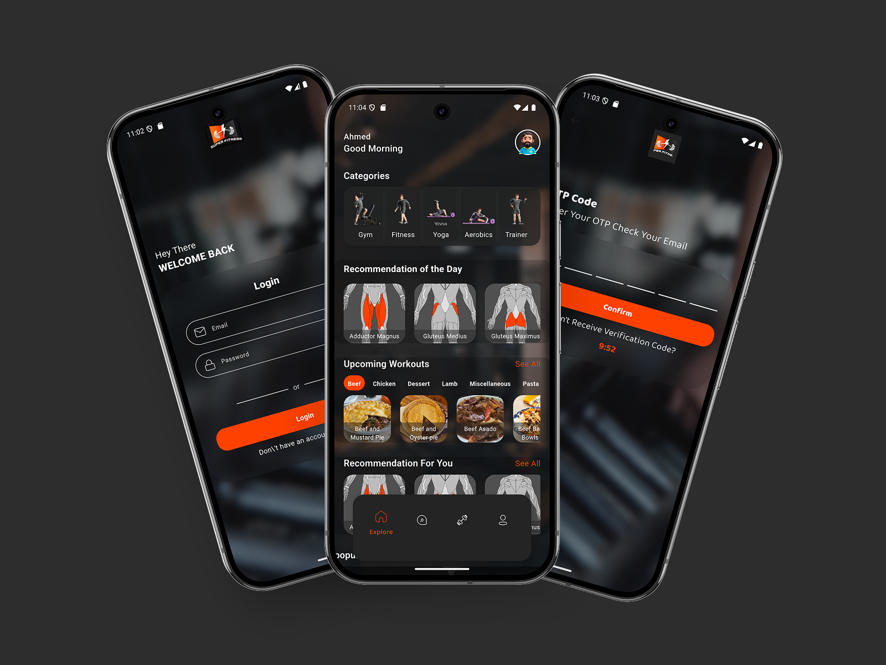
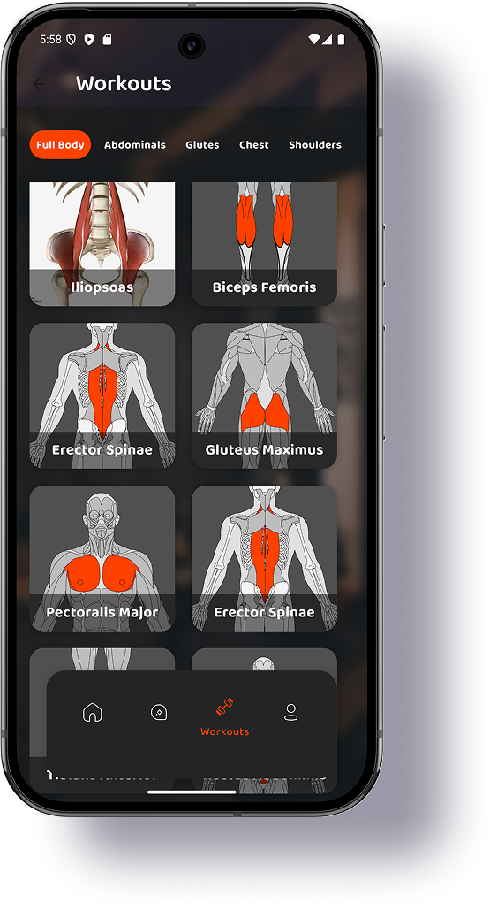
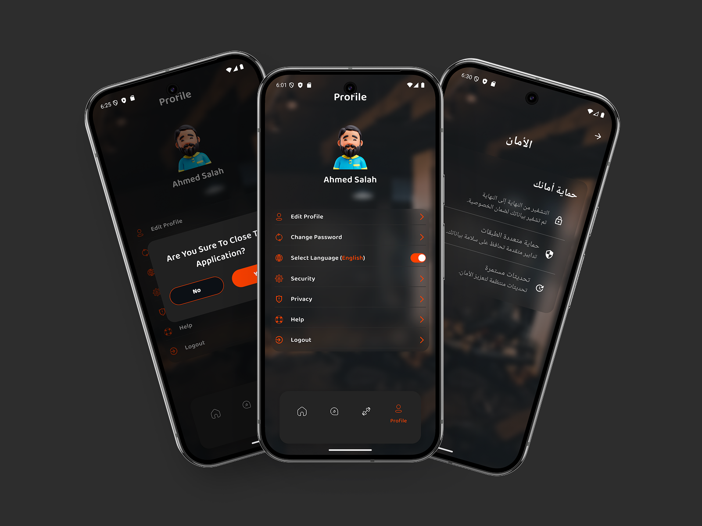

<!DOCTYPE html>
<html lang="en">
<head>
  <link rel="stylesheet" href="styles.css">
  <meta charset="UTF-8">
  <meta name="viewport" content="width=device-width, initial-scale=1">

</head>
<body>
<h2 id="screenshots">Screenshots</h2>

  

    
    
<strong>Home Screen</strong>

  

  

    
    
<strong>Workouts Screen</strong>

  

  

    
    
<strong>Profile Screen</strong>

  

<h1>Super Fitness</h1>

Welcome to <strong>Super Fitness</strong>, a Flutter application designed to help users achieve their fitness goals through personalized workouts, smart coaching, and nutrition recommendations.

<h2>Table of Contents</h2>
<ul>
  <li><a href="#introduction">Introduction</a></li>
  <li><a href="#features">Features</a></li>
  <li><a href="#architecture">Architecture & Technology</a></li>
  <li><a href="#structure">Project Structure</a></li>
  <li><a href="#screenshots">Screenshots</a></li>
  <li><a href="#contributors">Contributors</a></li>
  <li><a href="#setup">Setup Instructions</a></li>
  <li><a href="#contribute">How to Contribute</a></li>
  <li><a href="#license">License</a></li>
</ul>

<h2 id="introduction">Introduction</h2>

<strong>Super Fitness</strong> is a cross-platform mobile app built with Flutter that offers:

<ul>
  <li>Personalized workout routines</li>
  <li>Smart AI coaching</li>
  <li>Nutrition recommendations</li>
</ul>

<h2 id="features">Features</h2>

<h3>1. Authentication and User Info Gathering</h3>
<ul>
  <li><strong>Sign Up / Sign In</strong>: Secure user authentication</li>
  <li><strong>User Details</strong>: Collects age, weight, height, gender, goals, and activity level</li>
  <li><strong>Profile Completion</strong>: Guides users for accurate data entry</li>
</ul>

<h3>2. Smart Coach (AI Assistance)</h3>
<ul>
  <li><strong>AI Chat</strong>: Smart coach interaction</li>
  <li><strong>Chat History</strong>: Saves and displays previous conversations</li>
  <li><strong>Personalized Tips</strong>: Guidance based on user profile</li>
</ul>

<h3>3. Home Screen</h3>
<ul>
  <li><strong>Food Suggestions</strong>: Based on goals and preferences</li>
  <li><strong>Workout Categories</strong>: Gym, Yoga, Trainer, etc.</li>
  <li><strong>Trending Workouts</strong></li>
</ul>

<h3>4. Workouts Screen</h3>
<ul>
  <li><strong>Workout List & Details</strong>: Duration, Equipment, Video Links</li>
</ul>

<h3>5. Profile Screen</h3>
<ul>
  <li><strong>Overview</strong>: User stats</li>
  <li><strong>Edit Info</strong>: Update preferences</li>
  <li><strong>Progress Tracking</strong>: (Coming soon)</li>
</ul>

<h2 id="architecture">Architecture & Technology</h2>
<ul>
  <li><strong>Clean Architecture</strong></li>
  <li><strong>Cubit</strong> for State Management</li>
  <li><strong>Injectable</strong> for Dependency Injection</li>
  <li><strong>Repository Pattern</strong></li>
  <li><strong>Retrofit</strong> for API</li>
  <li><strong>Localization</strong> with .arb files</li>
</ul>

<h2 id="structure">Project Structure</h2>

<pre>
src/
├── data/
│   ├── api/
│   │   ├── core/
│   │   │   ├── api_request_models/
│   │   │   ├── api_response_models/
│   │   │   ├── constants/
│   │   │   └── errors/
│   │   ├── second_base_url/
│   │   ├── upload_api_manger/
│   │   ├── api_services.dart
│   │   ├── api_services.g.dart
│   │   └── network_factory.dart
│   ├── data_source/
│   │   ├── local/
│   │   ├── online/
│   ├── repositories_impl/
├── domain/
│   ├── entities/
│   ├── repositories/
│   └── usecases/
├── presentation/
│   ├── managers/
│   ├── pages/
│   └── shared/
├── main.dart
└── super_fitness_app.dart
</pre>

<h2 id="setup">Setup Instructions</h2>
<ol>
  <li>Clone the repo:
    <pre><code>git clone https://github.com/your-username/super_fitness.git</code></pre>
  </li>
  <li>Navigate into project:
    <pre><code>cd super_fitness</code></pre>
  </li>
  <li>Install packages:
    <pre><code>flutter pub get</code></pre>
  </li>
  <li>Generate DI files:
    <pre><code>flutter pub run build_runner build --delete-conflicting-outputs</code></pre>
  </li>
  <li>Run the app:
    <pre><code>flutter run</code></pre>
  </li>
</ol>

<h2 id="contribute">How to Contribute</h2>

Follow these steps:

<ol>
  <li>Fork the repository</li>
  <li>Create a feature branch:
    <pre><code>git checkout -b feature/your-feature</code></pre>
  </li>
  <li>Commit your changes:
    <pre><code>git commit -m "Your message"</code></pre>
  </li>
  <li>Push:
    <pre><code>git push origin feature/your-feature</code></pre>
  </li>
  <li>Create a Pull Request</li>
  <li>Follow coding standards and comment your code</li>
  <li>Test your changes thoroughly</li>
</ol>

<h2 id="license">License</h2>

This project is licensed under the MIT License. See the <a href="LICENSE">LICENSE</a> file for details.

<h2 id="contributors">👥 Contributors</h2>
<table id="contributors-table">
  <tr>
    <td>
      <a href="https://github.com/ahmed-sala">
        
         <strong>Ahmed Salah</strong> 
        Flutter Developer 
        Commits: Loading...
      </a>
    </td>
    <td>
      <a href="https://github.com/OmarHamedMakram123">
        
         <strong>Omar Makram</strong> 
        Flutter Developer 
        Commits: Loading...
      </a>
    </td>
    <td>
      <a href="https://github.com/ali72-20">
        
         <strong>Ali Safwat</strong> 
        Flutter Developer 
        Commits: Loading...
      </a>
    </td>
  </tr>
</table>

<!-- Other content... -->

</body>
</html>
